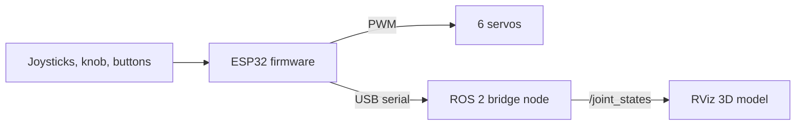

# ATLAS Robot Arm

A low-cost, 3D-printed robotic arm controlled by an ESP32, built as an open engineering project by **ATLAS (Applied Tech Learning at Summit)**. The goal is a reliable, well-documented platform for learning ROS 2, perception, and robot manipulation research.

> **Status:** 🚧 Work in progress. ESP32 firmware v2 compiles and passes simulation tests; hardware bring-up and calibration are underway.

<!-- Add a photo or GIF of the arm here:
 -->


---

## Features

- 5 servo joints in use (base, shoulder, elbow, wrist roll, gripper); wrist pitch planned
- Joystick control with speed control, two modes, and a knob-controlled gripper
- Safety first: boots disarmed, joints power up one at a time, every move is limited and ramped
- Built-in calibration mode for finding each joint's range of motion
- Optional OLED status display
- ROS 2 integration: an RViz model that mirrors the real arm over USB serial

## How it fits together



The ESP32 handles real-time control and safety. The laptop handles the ROS 2 side. The ESP32 runs no ROS code: it streams plain text lines that a Python node turns into ROS 2 messages.

---

## Hardware

| Part | Qty | Notes |
| --- | --- | --- |
| ESP32-WROOM-32 DevKit (CP2102, USB-C) | 1 | Main controller |
| MG90S servo (metal gear) | 4 | Base, shoulder, elbow, wrist pitch |
| SG90 servo (plastic gear) | 3 | Wrist roll, gripper, 1 spare |
| Joystick module | 2 | Powered from **3.3 V** |
| 10 kΩ potentiometer | 1 | Gripper knob |
| Pushbutton | 1 | Arm / disarm |
| SSD1306 OLED, 128×64 I2C | 1 | Optional |
| 5 V / 5-10 A regulated supply | 1 | Servos only, shared ground with the ESP32 |
| 3D-printed arm parts | — | Based on the open-source E-Z RoboArm design |

Full pin map and power wiring: [`atlas_arm_esp32/WIRING_GUIDE.md`](atlas_arm_esp32/WIRING_GUIDE.md)

---

## Repository layout

| Folder | Contents |
| --- | --- |
| [`atlas_arm_v2/`](atlas_arm_v2/) | **Main firmware** + [calibration guide](atlas_arm_v2/CALIBRATION_GUIDE.md) |
| [`atlas_arm_esp32/`](atlas_arm_esp32/) | v1 firmware (fallback), wiring guide, gripper autonomy plan |
| [`mg90s_bench_test/`](mg90s_bench_test/) | Test a single servo before installing it |
| [`oled_test/`](oled_test/) | Test the OLED on its own |
| [`ros2_ws/`](ros2_ws/) | ROS 2 robot model, serial bridge, and [build/ROS 2 guide](ros2_ws/BUILD_DAY_AND_ROS2_GUIDE.md) |
| [`checklists/`](checklists/) | Post-wiring checklist (opens in Google Sheets) |

---

## Quick start

### 1. Flash the firmware (Arduino IDE 2)

1. Add this URL under **File → Preferences → Additional boards manager URLs**:
   `https://espressif.github.io/arduino-esp32/package_esp32_index.json`
2. **Boards Manager:** install **esp32 by Espressif Systems**, version **3.x**.
3. **Library Manager:** install **Adafruit SSD1306** (accept Adafruit GFX + BusIO).
4. Open `atlas_arm_v2/atlas_arm_v2.ino`, select board **ESP32 Dev Module**, upload.
5. Serial Monitor at **115200** baud, line ending **Newline**. Type `h` for commands.

### 2. Wire and check

Follow the [wiring guide](atlas_arm_esp32/WIRING_GUIDE.md), then work through the [checklist](checklists/) stage by stage before powering the servos.

### 3. Calibrate

Follow the [calibration guide](atlas_arm_v2/CALIBRATION_GUIDE.md) to align the servo horns and set each joint's range of motion.

### 4. ROS 2 (optional)

On Ubuntu with ROS 2 (Humble or Jazzy):

```bash
cd ~/ros2_ws && colcon build --symlink-install && source install/setup.bash
ros2 launch atlas_arm_description display.launch.py                    # simulate with sliders
ros2 launch atlas_arm_bridge mirror.launch.py port:=/dev/ttyUSB0       # mirror the real arm
```

Close the Arduino Serial Monitor first: only one program can use the USB port.

---

## Controls

| Input | Action |
| --- | --- |
| ARM button | Arm / disarm (disarmed = servos limp) |
| Joystick 1 X / Y | Base / shoulder |
| Joystick 2 X / Y | Wrist roll / elbow (ARM mode) or wrist pitch (WRIST mode) |
| Joystick 2 press | Switch mode · hold 1 s: return to rest |
| Knob | Gripper position |

---

## Troubleshooting

| Problem | Fix |
| --- | --- |
| `#error "Needs the ESP32 Arduino core 3.x"` | Select **ESP32 Dev Module** and install **esp32 by Espressif Systems 3.x**. In PlatformIO, the official `espressif32` platform is core 2.x; use the [pioarduino](https://github.com/pioarduino/platform-espressif32) platform instead |
| PlatformIO on Windows: `FileNotFoundError` while installing the ESP32 platform | Windows blocks file paths of 260+ characters. Enable long paths (PowerShell as admin, then restart): `New-ItemProperty -Path "HKLM:\SYSTEM\CurrentControlSet\Control\FileSystem" -Name "LongPathsEnabled" -Value 1 -PropertyType DWORD -Force`, and set the user environment variable `PLATFORMIO_CORE_DIR=C:\pio` |
| No serial port appears | Try a different USB-C cable (many are charge-only); on Windows install the Silicon Labs CP210x driver |
| ESP32 resets when servos move | Check the common ground, and that the servos are powered only from the 5 V supply |
| OLED shows nothing | Run [`oled_test`](oled_test/) and follow its step-by-step messages |

---

## Roadmap

- [x] ESP32 firmware with joystick control, safety features, and calibration mode
- [x] ROS 2 model and real-arm mirror in RViz
- [ ] Hardware bring-up and calibration (in progress)
- [ ] Shoulder counterbalance, then wrist pitch
- [ ] ROS 2 → arm commands and inverse kinematics
- [ ] Overhead camera (ESP32-CAM) for perception
- [ ] Contact-sensing gripper ([plan](atlas_arm_esp32/GRIPPER_AUTONOMY_PLAN.md))

---

## Contributing

This is an ATLAS club project, and contributions are welcome. Open areas include CAD, wiring diagrams, firmware, ROS 2, testing, and documentation. Check the Issues tab for starter tasks.

When you contribute, please document **what** you changed, **why**, and **what you measured**, including what didn't work. Failed approaches are part of the record.

## Contributors

- Mitanshu Paul
- 

## Credits

- Design based on the open-source **E-Z RoboArm** https://www.thingiverse.com/thing:4782837
- 

## License

<!-- Choose a license, e.g. MIT for code. Check the original arm design's license before redistributing modified CAD files. -->
TBD
